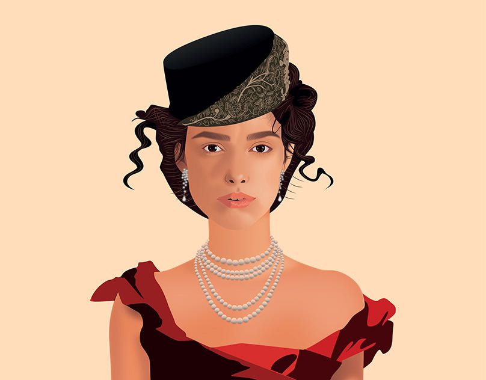

Меня зовут Ирина. Мне 29 лет. Я люблю читать. В последнее время я прочитала книги: "Анна Каренина" Л.Н. Толстого, "Доктор Живаго" Б.Л. Пастернака. В моих планах прочитать "Судьба человека" М.А. Шолохова и "Палата №6" А.П. Чехова.

Я прикладываю картинку а не свою фотографию. Спасибо за понимание.

